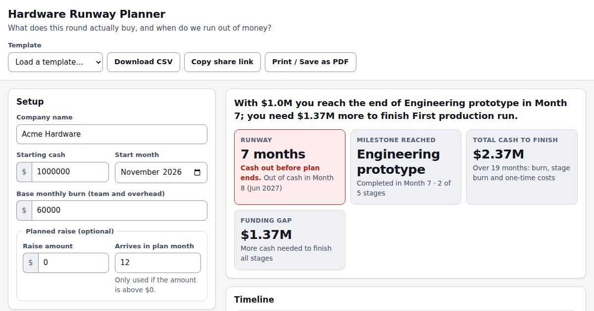

# Hardware Runway Planner

A single-page tool that answers one question for hardware startups and the investors who back them:
**what does this round actually buy, and when do we run out of money?**

Enter starting cash, monthly burn and a list of milestones (lab prototype → production run). The tool
simulates cash month by month and shows runway, the milestone you reach before cash-out, the total cash
needed to finish, and the funding gap. Everything updates live.



## Features

- Setup panel: company, starting cash, start month, base burn, optional planned raise (amount + month).
- Milestone editor: add, delete, rename and reorder stages (drag, up/down buttons, or keyboard ↑/↓ on the grip).
- Gantt timeline with a red cash-out line and the planned raise marked.
- Cash balance chart (negative area shaded) plus the same data as an accessible table.
- Summary cards and a plain-English sentence ("With $1.0M you reach the end of …").
- Templates: Generic hardware, Energy hardware, Advanced materials.
- Export: CSV of the month-by-month table, shareable link (plan encoded in the URL hash), print / save as PDF.
- Plan autosaves to `localStorage` (and works if storage is blocked). Light and dark mode follow the OS.

## How the cash math works

Months are numbered from 1 (the start month). Stages run back to back in list order starting at month 1,
so a stage starting in month 5 lasting 3 months is active in months 5, 6 and 7.

For each month:

```
net = planned raise (in its month)
    - base monthly burn
    - extra monthly burn of every active stage
    - one-time cost of any stage that starts this month
balance = previous balance + net          (month 1 starts from starting cash)
```

- **Runway** = the number of months whose ending balance is still ≥ $0. The first month that ends below
  zero is the "cash-out month" (runway + 1). Example: $600k at $50k/month gives exactly 12 months.
- **Total cash to finish** = all spending (burn, stage burn, one-time costs) from month 1 to the end of the last stage.
- **Funding gap** = how far the balance falls below zero at its lowest point before the last stage ends
  (after counting any planned raise); $0 if fully funded.
- **Milestone reached** = the last stage that finishes on or before the runway, counting stages in order.
- Simulation is capped at 120 months, so zero burn or huge cash can never loop forever; in that case runway shows "120+ months".
- Limits: 20 stages, stage duration 1–60 months, money values $0–$1B. Invalid input is flagged and replaced by a safe value, never `NaN`.

All of this lives in pure functions in [`lib/runway.js`](lib/runway.js): `buildSchedule`, `monthlyCashflow`,
`runwayMonths`, `fundingGap`.

## Run locally

No build step.

```sh
python3 -m http.server 8000
# open http://localhost:8000
```

(Opening `index.html` directly also works, except "Copy share link" needs a secure context for the clipboard API and falls back to a prompt.)
Chart.js 4.4.1 is loaded from cdnjs with a pinned version and SRI hash; without network the chart is replaced by the data table.

## Run the tests

Requires Node 18+; no dependencies.

```sh
node --test tests/runway.test.js
```

## Deploy on GitHub Pages

1. Push this repo to GitHub.
2. **Settings → Pages → Build and deployment → Deploy from a branch**.
3. Choose branch `main`, folder `/ (root)`, and save.

All asset paths are relative, so it works under `https://<user>.github.io/hardware-runway-planner/`. The empty `.nojekyll` file
tells Pages to serve files as-is.

For link previews, change the `og:image` value to an absolute URL such as `https://<user>.github.io/hardware-runway-planner/og-image.png`.

## Layout

```
index.html        page markup, Open Graph tags
styles.css        theme (CSS custom properties), layout, print stylesheet
app.js            UI wiring (DOM, chart, export)
lib/runway.js     pure cash-flow functions (also used by the tests)
data/templates.js template defaults
tests/            node --test unit tests
```

*A planning aid, not financial advice.*
